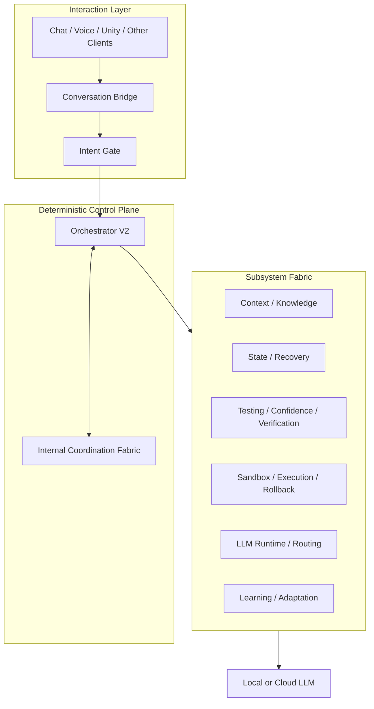

# NIIRONA Public Architecture

This document presents a deliberately simplified public architecture view.

It describes **responsibility boundaries**, not production implementation recipes.

---

## 1. Architectural principle

NIIRONA is organized around one rule:

> **Reasoning, knowledge, control, execution, verification, recovery, model runtime, and user interaction should not share the same owner.**

Each component should know only what it needs and control only what it is explicitly authorized to control.

---

## 2. High-level view

The production topology contains stronger boundaries than the public diagram shows.

---

## 3. Conversation Plane and Autonomous Execution Plane

NIIRONA separates conversation from autonomous execution.

### Conversation Plane

Optimized for:

- dialogue;
- explanation;
- natural-language interaction;
- conversational continuity;
- low-friction reasoning.

### Autonomous Execution Plane

Optimized for:

- explicit tasks;
- controlled tool use;
- code modification;
- tests;
- retries;
- execution evidence;
- rollback;
- durable completion state.

Talking about an action is not the same as authorizing the action.

---

## 4. Intent Gate

The Intent Gate is designed to sit between conversational input and privileged control actions.

It classifies requests such as:

- conversation;
- execute task;
- switch model;
- start a supported teaching workflow;
- invoke another supported system action.

It does not own or perform those actions.

It emits structured intent to the deterministic control plane.

---

## 5. Orchestrator V2

Orchestrator V2 is intentionally not an all-knowing AI agent.

Its public responsibilities are:

- deterministic coordination;
- lifecycle decisions;
- bounded state-transition control;
- module addressing;
- error propagation;
- recovery coordination;
- routing of authorized work.

It does not own:

- project knowledge;
- semantic context selection;
- model weights;
- long-term learning logic;
- sandbox internals;
- test intelligence;
- client UI.

The purpose is to avoid a control monolith.

---

## 6. External subsystem fabric

NIIRONA distributes major capabilities across specialized owners.

Public categories include:

### State and goals
Tracks task/runtime state and high-level goal structures.

### Project knowledge
Maintains structured information about project components and relationships.

### Advanced context
Builds a bounded, relevant working context for reasoning models.

### Execution sandbox
Runs experimental or potentially unsafe work in isolation.

### Test intelligence
Selects and interprets validation relevant to a change.

### Checkpoint and rollback
Preserves known-good state and supports reversal.

### Failure learning
Retains useful evidence from failed attempts.

### Confidence and hypothesis
Produces bounded signals that can request more evidence without owning system control.

Exact internal topology is intentionally not published.

---

## 7. LLM Runtime & Routing Manager

The model runtime is infrastructure, not the AI system itself.

Its public direction includes:

- model registry;
- runtime profiles;
- GPU mapping;
- process lifecycle;
- health state;
- local/cloud routing;
- controlled hot switching;
- explicit multi-model operation;
- future hardware-aware model selection.

The runtime layer does not decide why a model is needed.

---

## 8. Cloud-to-local teaching

Teaching is separated from model runtime.

The runtime layer may make multiple models available.

A separate teaching subsystem can coordinate:

- teacher model;
- local student model;
- evaluation cycles;
- acceptance criteria;
- promotion of successful results.

This keeps “run models” separate from “decide how one model teaches another.”

---

## 9. Recovery model

Restart recovery is a first-class requirement.

Publicly disclosed ideas include:

- persistent runtime state;
- durable delivery;
- acknowledgements;
- bounded retries;
- recovery barriers;
- watchdog supervision;
- replay protection;
- idempotency;
- explicit failure states.

Detailed ordering, timing, contracts, and recovery state machines are private.

---

## 10. Unity client boundary

The Unity application is a **separate client-side program**, not part of Orchestrator V2.

Its current role includes:

- avatar presentation;
- bone discovery and mapping;
- rig and pose handling;
- body / hand / finger control;
- graphical interaction;
- future voice/chat interaction.

The client can display and request actions, but control authority remains inside NIIRONA's deterministic core.

That boundary allows the avatar to evolve independently and allows future desktop/mobile clients to coexist.
