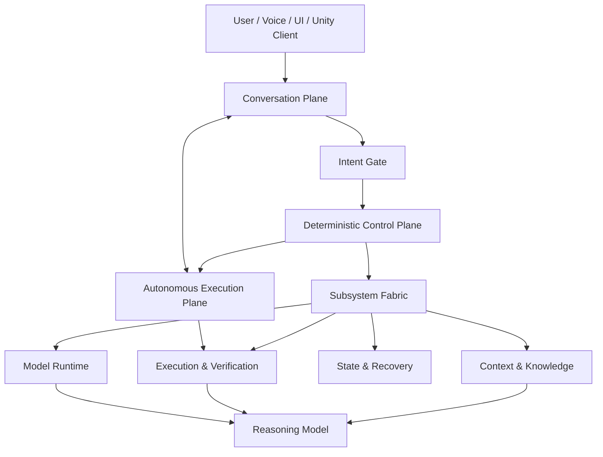

# NIIRONA

**NIIRONA is a local-first modular AI system designed to separate reasoning, control, context, execution, recovery, model infrastructure, and user interaction into independent components.**

It is not designed as a single monolithic agent wrapped around one LLM. The reasoning model is treated as a replaceable resource inside a larger system whose deterministic layers retain control over state, execution, routing, verification, and recovery.

> **Public architecture note:** this repository intentionally describes NIIRONA at a high level. Internal contracts, production source code, state machines, routing rules, security boundaries, recovery internals, private prompts, and implementation-specific interfaces are not published.

## What is NIIRONA?

NIIRONA is an independently developed AI system focused on local operation, autonomous software-engineering tasks, project-aware context, controlled execution, recovery after failures, replaceable local/cloud LLMs, voice interaction, and an interactive avatar-based client.

The core design principle is simple:

> **The LLM reasons; it does not own the system.**

Control, state, context, execution, testing, recovery, and model runtime are separated so they can be tested and evolved independently.

## Independent project

NIIRONA is an independent project developed by one developer. Architecture, implementation, integration, testing, and validation are carried out as a solo engineering effort, with AI tools used as part of the development workflow.

---

## Why NIIRONA exists

Many agent systems begin with a model and gradually attach memory, tools, planning, retries, and orchestration around it.

NIIRONA starts from the opposite direction: the model should remain replaceable, while the surrounding system keeps durable ownership of:

- state;
- execution;
- context;
- verification;
- recovery;
- routing;
- model lifecycle;
- user-interface boundaries.

This makes the project closer to a modular AI operating environment than a single chatbot with tools.

---

## Main capabilities and direction

NIIRONA is being developed around:

- local-first operation;
- local and cloud LLM support;
- deterministic orchestration;
- separate conversation and autonomous-task paths;
- explicit task activation;
- project-aware context retrieval;
- isolated execution;
- testing and execution evidence;
- checkpoint / rollback workflows;
- restart and long-session recovery;
- source and identity separation;
- model-runtime management;
- cloud-to-local teaching workflows;
- voice interaction;
- a separate Windows/Unity client with an interactive avatar.

---

## Unity / avatar client

The avatar side is no longer only a concept.

A **separate Unity application** has already been built for NIIRONA's visual client. Its current work includes:

- loading and controlling the avatar;
- discovering and mapping avatar bones;
- rig and pose handling;
- body and hand movement logic;
- finger-control work and neutral-hand calibration;
- a graphical menu / interaction layer;
- preparation for voice and chat integration.

The Unity application remains a **client**, not part of the deterministic AI core. NIIRONA can run without the avatar, and other clients can be connected to the same core later.

The current Unity work is still under active refinement, especially around hand/finger behavior and final connection to the main NIIRONA architecture.

---

## Public architecture

The diagram is intentionally simplified and does not expose internal message contracts or privileged interfaces.

---

## Conversation and execution are separate

NIIRONA does not treat every message as an execution command.

Conversation and autonomous execution use separate paths. A dedicated intent-classification layer is designed to determine whether an input is ordinary conversation, an explicit task, a model-management request, a teaching request, or another supported action.

The classifier does not execute the action itself. Execution remains behind deterministic control boundaries.

This is intended to prevent casual discussion from silently becoming a privileged system action.

---

## Deterministic control

NIIRONA uses a deterministic orchestration layer rather than allowing an LLM to own system control.

The orchestration layer coordinates bounded state transitions and subsystem actions while keeping knowledge, context, execution, recovery, and model runtime in their own owners.

That separation is one of the project's main architectural principles.

---

## Model runtime

NIIRONA treats LLMs as infrastructure.

The dedicated model-runtime direction includes:

- model registry;
- local and cloud providers;
- runtime profiles;
- GPU assignment;
- model process lifecycle;
- active-model state;
- controlled hot switching;
- health monitoring;
- explicit multi-model operation;
- hardware-aware model selection as a future capability.

The runtime layer provides infrastructure. It does not decide why a model is needed.

---

## Advanced context

NIIRONA's Advanced Context Manager is designed to maintain organized project context and provide only the relevant working set needed for a task.

At a high level, this includes:

- project-aware retrieval;
- code and dependency awareness;
- relevance and freshness;
- related tests and affected areas;
- historical context;
- bounded context expansion;
- architectural constraints.

The context layer supplies information; it does not own control flow.

---

## Execution, verification, and recovery

NIIRONA is designed around controlled execution rather than unrestricted tool calls.

The system direction includes:

**propose → isolate → execute → test → review evidence → integrate → observe → keep, repair, or roll back**

Publicly described resilience principles include:

- persistent runtime state;
- restart recovery;
- controlled retries;
- execution evidence;
- replay protection;
- idempotency;
- watchdog supervision;
- no silent fallback to obsolete control paths.

Detailed internal recovery protocols are intentionally not published.

---

## Current development state

As of **September 2026**:

- the main modular architecture is mature;
- Orchestrator V2 is implemented and under advanced integration/validation;
- core subsystem integration is advanced;
- restart and long-session behavior has been validated;
- explicit task activation and CAN-only runtime direction have been validated;
- legacy control overlap is being removed;
- the LLM Runtime & Routing Manager is a major next subsystem;
- the Intent Gate architecture is fixed and awaits implementation;
- cloud-to-local teaching is designed as a later subsystem;
- the separate Windows/Unity avatar client is substantially implemented and under refinement;
- final client-to-core integration is still pending.

See [STATUS.md](STATUS.md).

---

## What this repository is — and is not

This repository is a **public project overview**, not a production source release.

It intentionally does not publish:

- production source code;
- internal message schemas;
- orchestration tables;
- recovery state machines;
- capability maps;
- block-level protocols;
- private prompts;
- security internals;
- production model-launch commands;
- private configuration.

The goal is to make NIIRONA understandable without turning the documentation into a reconstruction guide.

---

## Documents

- [Architecture](ARCHITECTURE.md)
- [Capabilities](CAPABILITIES.md)
- [Current Status](STATUS.md)
- [Roadmap](ROADMAP.md)
- [Public Disclosure Policy](PUBLIC_DISCLOSURE.md)
- [Russian overview](README_RU.md)
- [Source Availability Notice](LICENSE-NOTICE.md)

---

## Long-term direction

NIIRONA is being built toward a system where:

- reasoning models can be swapped without redesigning the whole platform;
- local hardware remains the default environment;
- cloud models are optional resources;
- context is managed independently from the model;
- failures are observable and recoverable;
- code changes are verified before becoming durable;
- UI, voice, desktop, mobile, and avatar clients remain replaceable surfaces;
- the system can grow without turning its orchestrator into a monolith.
